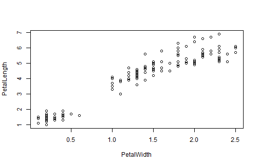

## It helps you understand the iris dataset

When you first start using R in the Coursera Data Science specialization series of classes
you are asked to use some of the datasets in the datasets package.

1. These datasets are new to you and you don't have any perspective as to what is in them
2. You don't know R well enough to pull the data out of the datasets to view them
3. The graphing class comes later in the series and so you can't visualize what is in the datasets
4. It has an interactive rChart in it!

--- 

## Datasets are new to you and you don't know R 
## (1 & 2)

When you first are exposed to the datasets, the teacher may ask you to str the dataset.  As demonstrated in the following code.   

```r
str(iris)
```

```
## 'data.frame':	150 obs. of  5 variables:
##  $ SepalLength: num  5.1 4.9 4.7 4.6 5 5.4 4.6 5 4.4 4.9 ...
##  $ SepalWidth : num  3.5 3 3.2 3.1 3.6 3.9 3.4 3.4 2.9 3.1 ...
##  $ PetalLength: num  1.4 1.4 1.3 1.5 1.4 1.7 1.4 1.5 1.4 1.5 ...
##  $ PetalWidth : num  0.2 0.2 0.2 0.2 0.2 0.4 0.3 0.2 0.2 0.1 ...
##  $ Species    : Factor w/ 3 levels "setosa","versicolor",..: 1 1 1 1 1 1 1 1 1 1 ...
```

This is not great.  Because you haven't used R much, it mostly looks like a bunch of garbled text.

---

## Graphing comes later (3)

You don't start graphing until the 4th course in the series.  Then you will build a graph like this...  


```r
plot(PetalLength ~ PetalWidth, data = iris)
```

 

NOT super informative.  You can't even hover over a point to see what the value is.  

---

## There is an interactive rChart in my App (4)

If you didn't notice the interactive chart, go back and hover over a point.  

## It is cool  


Not only can you dynamically select what is displayed, you can hover and get the values.  Use my Shiny App!  

## Thank you  

